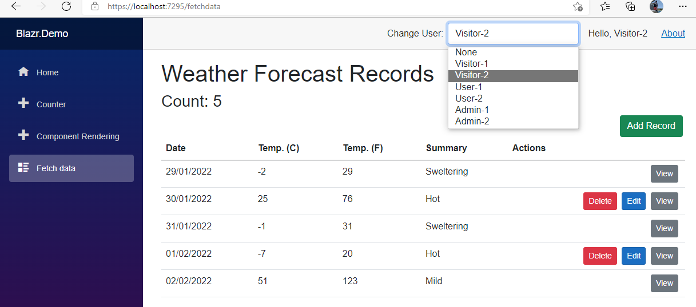
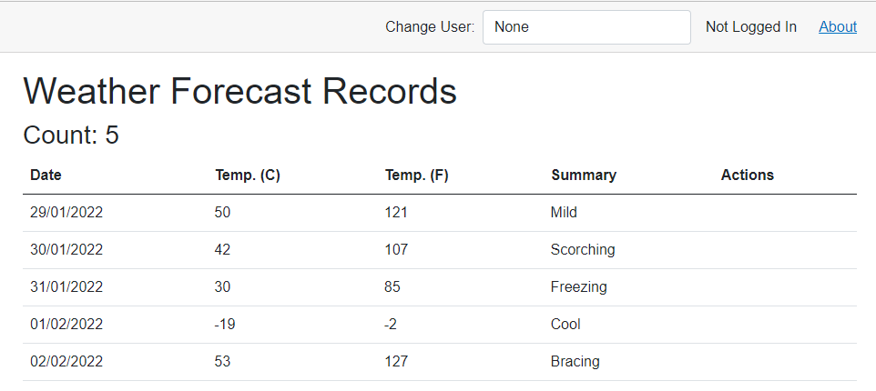
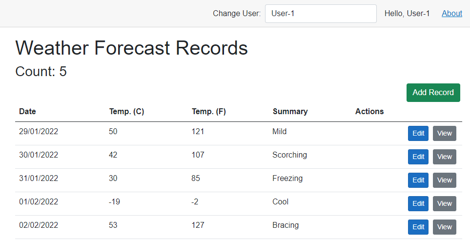
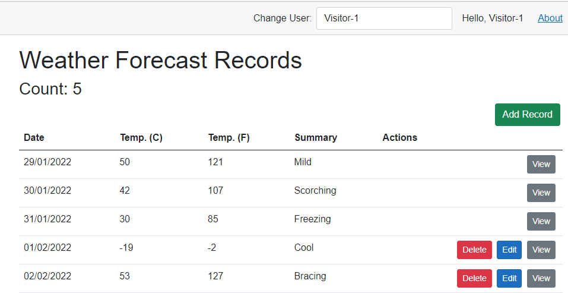
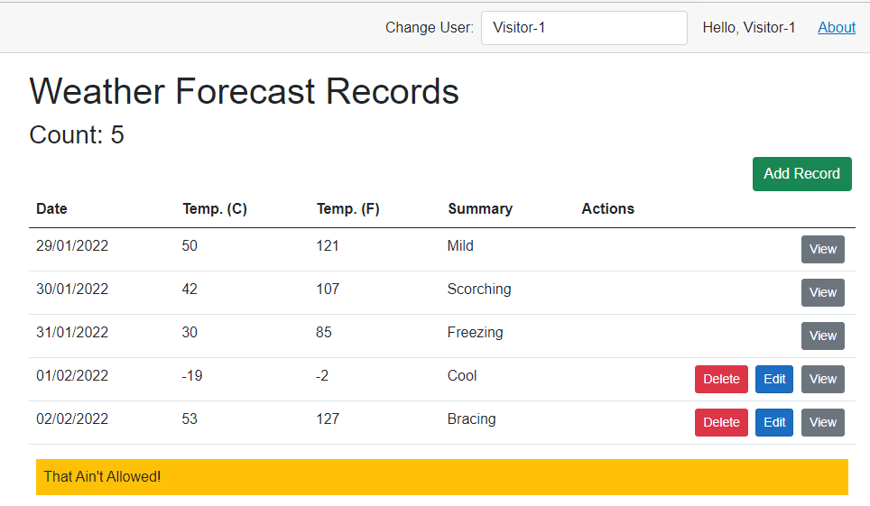
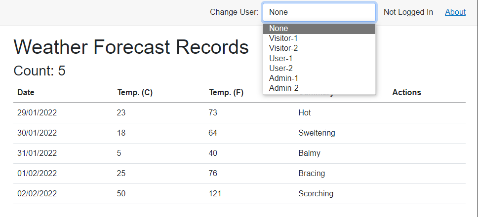

# Policy Based Authorization in Blazor

In many applications, authorization needs to be more granular and complex that the canned examples in many demos.  This article shows the read how to implement policy based authorization in these more complex situations.

## Authentication and Ownership

We need a simple authenticator to let us switch identities, and a field in each weather forecast to identify the owner.  You can see the details in the Appendix of this article.  A quick point on nomenclature: I use the term `Identity` rather than `user`. 

The image below illustrates what we'll achieve.



## Authorization

Before delving into the detail, let's look at the end result.

An anonymous user can view the list, but that's all.



Users can edit or view any record, but not delete it.



Admins you can Edit/View/Delete.


Visitors can View all the records, but only Edit/Delete your own.



To demonstrate using authorization in a service, the application checks that any user attempting to add a record is at least a user.  So even through the "Add Record" button shows when logged in as a visitor, they can't actual add a record in the backend services.



## Authorization Button

I've built an `AuthorizeButton` component to encapsulate the button code.  There are two versions:

`AuthorizeButton` requirs a policy.  This is the Add button at the top of the page.

```html
<AuthorizeButton Policy=@AppPolicies.IsVisitor class="btn btn-success" @onclick="AddRecord">Add Record</AuthorizeButton>
```
While `AuthorizeRecordButton` requires a policy and an `AppAuthFields` object built from a record.  This is thr Edit button that appears in each row and uses the row record to populate the `AppAuthFields` instance.

```html
<AuthorizeRecordButton Policy=@AppPolicies.IsEditorPolicy AuthFields="this.GetAuthFields(forecast)" type="button" class="btn-sm btn-primary" ClickEvent="() => this.EditRecord(forecast.Id)">Edit</AuthorizeRecordButton>
```

`AuthorizeButton` looks like this.  Much of the code is pretty standard component fare, so I'll concentrate on just the authorization bit.

We check in `OnInitialized` to make sure we have a `AuthTask` cascade i.e. we have the upstream authentication and authorization configured.  If not then we throw an exception.

`BuildRenderTree` calls `CheckPolicy()` to check if it should render the button.  `CheckPolicy` gets the authentication state and then calls `AuthorizeAsync` on the injected `AuthorizationService`, passing in the `IdentityPrincipal` that represents the user, a null for the resource object (we'll come to resource objects shortly), and the policy name to apply.  If the result is success then we display the button.

We are coding the same behaviour as the generic authorize components in the specific button context.  

```csharp
var result = await this.AuthorizationService.AuthorizeAsync(state.User, null, Policy);
```

```csharp
public class AuthorizeButton : ComponentBase
{
    [Parameter] public bool Show { get; set; } = true;
    [Parameter] public bool Disabled { get; set; } = false;
    [Parameter] public string Policy { get; set; } = String.Empty;
    [Parameter] public RenderFragment? ChildContent { get; set; }
    [Parameter] public EventCallback<MouseEventArgs> ClickEvent { get; set; }
    [Parameter(CaptureUnmatchedValues = true)] public IDictionary<string, object> SplatterAttributes { get; set; } = new Dictionary<string, object>();
    [CascadingParameter] public Task<AuthenticationState>? AuthTask { get; set; }

    [Inject] protected IAuthorizationService? _authorizationService { get; set; }
    protected IAuthorizationService AuthorizationService => _authorizationService!;

    protected CSSBuilder CssClass = new CSSBuilder("btn me-1");

    protected override void OnInitialized()
    {
        if (AuthTask is null)
            throw new Exception($"{this.GetType().FullName} must have access to cascading Paramater {nameof(AuthTask)}");
    }

    protected override async void BuildRenderTree(RenderTreeBuilder builder)
    {
        if (this.Show && await this.CheckPolicy())
        {
            CssClass.AddClassFromAttributes(SplatterAttributes);
            builder.OpenElement(0, "button");
            builder.AddMultipleAttributes(1, this.SplatterAttributes);
            builder.AddAttribute(1, "class", CssClass.Build());

            if (Disabled)
                builder.AddAttribute(4, "disabled");

            if (ClickEvent.HasDelegate)
                builder.AddAttribute(5, "onclick", EventCallback.Factory.Create<MouseEventArgs>(this, ClickEvent));

            builder.AddContent(6, ChildContent);
            builder.CloseElement();
        }
    }

    protected virtual async Task<bool> CheckPolicy()
    {
        var state = await AuthTask!;
        var result = await this.AuthorizationService.AuthorizeAsync(state.User, null, Policy);
        return result.Succeeded;
    }
}

```

`AuthorizeRecordButton` extends `AuthorizeButton` by passing an `AppAuthFields` obect to `AuthorizeAsync` as the resource object.  We'll see how the `AuthorizationService` uses this shortly.

```csharp
public class AuthorizeRecordButton : AuthorizeButton
{
    [Parameter] public object? AuthFields { get; set; }

    protected override async Task<bool> CheckPolicy()
    {
        var state = await AuthTask!;
        var result = await this.AuthorizationService.AuthorizeAsync(state.User, AuthFields, Policy);
        return result.Succeeded;
    }
}
```

### Policies

Policies are defined as `AuthorizationPolicy` objects.  Policies are mapped to names when the `AuthorizationService` is instantiated.  The `AuthorizationService` maps the policy name we provide to an `AuthorizationPolicy` object.

We build policies using an `AuthorizationPolicyBuilder`.

The Application defines a static `AppPolicies` class to hold all the policy code.

1. Defines a set of nomenclature constants for role and policy string names.
2. Builds out a set of policies using the `AuthorizationPolicyBuilder`.
3. Defines a dictionary of the defined application policies to load into `AuthorizationService`.
4. Defines an `IServiceCollection` extension method for all the DI objects we need to load for our policies.

```csharp
public static class StandardPolicies
{
    public const string AdminRole = "AdminRole";
    public const string UserRole = "UserRole";
    public const string VisitorRole = "VisitorRole";

    public const string IsEditorPolicy = "IsEditorPolicy";
    public const string IsViewerPolicy = "IsViewerPolicy";
    public const string IsManagerPolicy = "IsManagerPolicy";
    public const string IsAdminPolicy = "IsAdminPolicy";
    public const string IsUserPolicy = "IsUserPolicy";
    public const string IsVisitor = "IsVisitor";
```

Our basic Admin/User/Visitor policies that just check that an identity is logged in an in one or more roles.  These are our site based policies.

Note that for user to pass a policy they must satisfy all the requirements (an AND in logic terms).
  
```csharp
    public static AuthorizationPolicy IsAdminAuthorizationPolicy
        => new AuthorizationPolicyBuilder()
        .RequireAuthenticatedUser()
        .RequireRole(AdminRole)
        .Build();

    public static AuthorizationPolicy IsUserAuthorizationPolicy
        => new AuthorizationPolicyBuilder()
        .RequireAuthenticatedUser()
        .RequireRole(AdminRole, UserRole)
        .Build();

    public static AuthorizationPolicy IsVisitorAuthorizationPolicy
        => new AuthorizationPolicyBuilder()
        .RequireAuthenticatedUser()
        .RequireRole(AdminRole, UserRole, VisitorRole)
        .Build();

```

Next our record based policies.  We add requirements, defined as an `IAuthorizationRequirement` list.  In our case we have a `RecordEditorAuthorizationRequirement` and a `RecordManagerAuthorizationRequirement`.  We'll look at these in more detail shortly.

```csharp

    public static AuthorizationPolicy IsEditorAuthorizationPolicy
        => new AuthorizationPolicyBuilder()
        .RequireAuthenticatedUser()
        .AddRequirements(new RecordEditorAuthorizationRequirement())
        .Build();
    
    public static AuthorizationPolicy IsManagerAuthorizationPolicy
        => new AuthorizationPolicyBuilder()
        .RequireAuthenticatedUser()
        .AddRequirements(new RecordManagerAuthorizationRequirement())
        .Build();

    public static AuthorizationPolicy IsViewerAuthorizationPolicy
        => new AuthorizationPolicyBuilder()
        .RequireAuthenticatedUser()
        .Build();
```

The `Policies` dictionary provides a convenient mechanism for defining and managing all the application policies that `AuthorizationService` needs to load.

```csharp
    public static Dictionary<string, AuthorizationPolicy> Policies
    {
        get
        {
            var policies = new Dictionary<string, AuthorizationPolicy>();

            policies.Add(IsAdminPolicy, IsAdminAuthorizationPolicy);
            policies.Add(IsUserPolicy, IsUserAuthorizationPolicy);
            policies.Add(IsVisitor, IsVisitorAuthorizationPolicy);

            policies.Add(IsManagerPolicy, IsManagerAuthorizationPolicy);
            policies.Add(IsEditorPolicy, IsEditorAuthorizationPolicy);
            policies.Add(IsViewerPolicy, IsViewerAuthorizationPolicy);
            return policies;
        }
    }
```

Finally we define an `IServiceCollection` extension to add the policy handler services.  We'll look at these in more detail shortly.

```csharp
    public static void AddAppPolicyServices(this IServiceCollection services)
    {
        services.AddSingleton<IAuthorizationHandler, RecordOwnerEditorAuthorizationHandler>();
        services.AddSingleton<IAuthorizationHandler, RecordEditorAuthorizationHandler>();
        services.AddSingleton<IAuthorizationHandler, RecordManagerAuthorizationHandler>();
        services.AddSingleton<IAuthorizationHandler, RecordOwnerManagerAuthorizationHandler>();
    }
```

This then allows us to define our services in `Program` or our application `IServiceCollection` extension method like this:

```csharp
services.AddScoped<AuthenticationStateProvider, VerySimpleAuthenticationStateProvider>();
services.AddAppPolicyServices();
services.AddAuthorization(config =>
{
    foreach (var policy in AppPolicies.Policies)
    {
        config.AddPolicy(policy.Key, policy.Value);
    }
});
```

### IAuthorizationRequrements and IAuthorizationHandlers

In the policies we defined `IAuthorizationRequirement` classes.  `RecordEditorAuthorizationRequirement` looks like this.  It's an empty class. `IAuthorizationRequirement` is also empty.

```csharp
public class RecordEditorAuthorizationRequirement : IAuthorizationRequirement { }
```

`IAuthorizationHandlers` implement the interface through the  `AuthorizationHandler` base class.  The base class takes two generics:

1. `TRequirement`, our empty `AuthorizationRequirement` class.
2. `TResource`, the resource type we'll use.  This is the `resource` object we passed in `AuthorizationService.AuthorizeAsync`.this can be an object: we are using the `AppAuthFields` class which we  populate from a record.

Our editor authorization handlers look like this. `TRequirement` is `RecordEditorAuthorizationRequirement` and `TResource` is `AppAuthFields`. `HandleRequirementAsync` is the method called to do the authorization.  

The first handler gets the user's Id, checks it against the `OwnerId` provided in the `AppAuthFields` instance and sets  success or failure in the provided `AuthorizationHandlerContext` instance.

```csharp
public class RecordOwnerEditorAuthorizationHandler : AuthorizationHandler<RecordEditorAuthorizationRequirement, AppAuthFields>
{
    protected override Task HandleRequirementAsync(AuthorizationHandlerContext context, RecordEditorAuthorizationRequirement requirement, AppAuthFields data)
    {
        var entityId = context.User.GetIdentityId();
        if (data is not null)
        {
            if (entityId != Guid.Empty && entityId == data!.OwnerId)
                context.Succeed(requirement);
        }
        return Task.CompletedTask;
    }
}
```
The second handler simply checks if the identity has the correct role.  We do this check here because a requrement is a logic OR.  Only one handler defined for a requirement needs return success for the requirement to return success. 

```csharp
public class RecordEditorAuthorizationHandler : AuthorizationHandler<RecordEditorAuthorizationRequirement, AppAuthFields>
{
    protected override Task HandleRequirementAsync(AuthorizationHandlerContext context, RecordEditorAuthorizationRequirement requirement, AppAuthFields data)
    {
        if (context.User.IsInRole(AppPolicies.UserRole) || context.User.IsInRole(AppPolicies.AdminRole))
            context.Succeed(requirement);

        return Task.CompletedTask;
    }
}
```

### How does a policy work?

The services container defines a set of IAuthorizationHandlers.  Each is "mapped" by it's `TRequirement` to a specific requirement class.  A policy defines one or more requirements, and is mapped to a name in the `AuthorizationService`.  

So when we do this:

```csharp
var result = await this.AuthorizationService.AuthorizeAsync(state.User, AuthFields, Policy);
```
We are telling the authorization service to check the user against the policy with the following resource.  The service maps the policy name to an actual policy and calls the policy.  It gets all the `IAuthorizationHandler` instances in the services container and specifically any that handle the defined requirement.  It runs `HandleRequirementsAsync` on each.  As this is an OR operation it returns on the first success.  

## Authentication

Before authorization comes authentication.  This article uses a very simple authentication provider that allows quick switching of the authentication context.  There's no passwords involved!

### Test Identities

Step one is to provide some test identities.

First a class for our identities:

```csharp
public record TestIdentity
{
    public string Name { get; set; } = string.Empty;
    public Guid Id { get; set; } = Guid.Empty;
    public string Role { get; set; } = string.Empty;

    public Claim[] Claims
        => new[]{
            new Claim(ClaimTypes.Sid, this.Id.ToString()),
            new Claim(ClaimTypes.Name, this.Name),
            new Claim(ClaimTypes.Role, this.Role)
    };
}
```

The identities are held in a static class we can use throughout the application.

1. The primary method is `GetIdentity`.  Pass in a user name and get back a `ClaimsIdentity` object.  
2. The Guids used are simple made up ones so we can reproduce them in test weather records.
3. We set roles for each identity.

```csharp
public static class TestIdentities
{
    public const string Provider = "Dumb Provider";

    public static ClaimsIdentity GetIdentity(string userName)
    {
        var identity = identities.FirstOrDefault(item => item.Name.Equals(userName, StringComparison.OrdinalIgnoreCase));
        if (identity == null)
            return new ClaimsIdentity();

        return new ClaimsIdentity(identity.Claims, Provider);
    }

    private static List<TestIdentity> identities = new List<TestIdentity>()
        {
            Visitor1Identity, 
            Visitor2Identity, 
            User1Identity, 
            User2Identity, 
            Admin1Identity, 
            Admin2Identity
        };

    public static List<string> GetTestIdentities()
    {
        var list = new List<string> { "None" };
        list.AddRange(identities.Select(identity => identity.Name!).ToList());
        return list;
    }

    public static Dictionary<Guid, string> TestIdentitiesDictionary()
    {
        var list = new Dictionary<Guid, string>();
        identities.ForEach(identity => list.Add(identity.Id, identity.Name));
        return list;
    }

    public static TestIdentity User1Identity
        => new TestIdentity
        {
            Id = new Guid("10000000-0000-0000-0000-100000000001"),
            Name = "User-1",
            Role = "UserRole"
        };

\\ .... more identities

    public static TestIdentity Admin2Identity
        => new TestIdentity
        {
            Id = new Guid("10000000-0000-0000-0000-300000000002"),
            Name = "Admin-2",
            Role = "AdminRole"
        };
}
```

Next we need an `AuthenticationStateProvider`.  This is it.  `ChangeIdentityAsync` switches users based on the provided user name.

```csharp
public class VerySimpleAuthenticationStateProvider : AuthenticationStateProvider
{
    ClaimsPrincipal? _user;

    public override Task<AuthenticationState> GetAuthenticationStateAsync()
        => Task.FromResult(new AuthenticationState(_user ?? new ClaimsPrincipal()));

    public Task<AuthenticationState> ChangeIdentityAsync(string username)
    {
        _user = new ClaimsPrincipal(TestIdentities.GetIdentity(username));
        var task = this.GetAuthenticationStateAsync();
        this.NotifyAuthenticationStateChanged(task);
        return task;
    }
}
```

Finally we need a "Log In Page".  In this case it's a simple select component we can place in the top bar.  THe select pulls the list of users from `TestIdentities` and calls `ChangeIdentityAsync` on the Authentication State Provider to switch users.

```csharp
@implements IDisposable
@namespace Blazr.Demo.Authorization.UI

<span class="me-2">Change User:</span>
<div class="w-25">
    <select id="userselect" class="form-control" @onchange="ChangeUser">
        @foreach (var value in TestIdentities.GetTestIdentities())
        {
            @if (value == _currentUserName)
            {
                 <option value="@value" selected>@value</option>
            }
            else
            {
                <option value="@value">@value</option>
            }
        }
    </select>
</div>
<span class="text-nowrap ms-3">
    <AuthorizeView>
        <Authorized>
            Hello, @(this.user.Identity?.Name ?? string.Empty)
        </Authorized>
        <NotAuthorized>
            Not Logged In
        </NotAuthorized>
    </AuthorizeView>
</span>

@code {
    [CascadingParameter] private Task<AuthenticationState>? authTask { get; set; }
    private Task<AuthenticationState> AuthTask => authTask!;

    [Inject] private AuthenticationStateProvider? authState { get; set; }
    private VerySimpleAuthenticationStateProvider AuthState => (VerySimpleAuthenticationStateProvider)authState!;

    private ClaimsPrincipal user = new ClaimsPrincipal();
    private string _currentUserName = "None";

    protected async override Task OnInitializedAsync()
    {
        var authState = await AuthTask;
        this.user = authState.User;
        AuthState.AuthenticationStateChanged += this.OnUserChanged;
    }

    private async Task ChangeUser(ChangeEventArgs e)
        =>  await AuthState.ChangeIdentityAsync(e.Value?.ToString() ?? string.Empty);

    private async void OnUserChanged(Task<AuthenticationState> state)
        => await this.GetUser(state);

    private async Task GetUser(Task<AuthenticationState> state)
    {
        var authState = await state;
        this.user = authState.User;
    }

    public void Dispose()
        => AuthState.AuthenticationStateChanged -= this.OnUserChanged;
    }
```

We add the component to `MainLayout`.

```csharp
@namespace Blazr.Demo.Authorization.UI
@inherits LayoutComponentBase

<PageTitle>Blazr.Demo</PageTitle>

<div class="page">
    <div class="sidebar">
        <NavMenu />
    </div>

    <main>
        <div class="top-row px-4">
            <UserBar />
            <a href="https://docs.microsoft.com/aspnet/" target="_blank">About</a>
        </div>

        <article class="content px-4">
            @Body
        </article>
    </main>
</div>
```

The control in action.



## Weather Forecast Ownership

This article uses a version of my Blazr Demo template.  You can see the full version [here on Giuthub](https://github.com/ShaunCurtis/Blazr.Demo).

I've added the `OwnerID` field to the record and popualte it with either the `Visitor-1` or `Visitor-2` Guid.

```csharp
public static List<WeatherForecast> CreateTestForecasts(int count)
{
    var list = new List<WeatherForecast>();
    var rng = new Random();
    for (var i = 1; i <= count; i++)
    {
        var c = rng.Next(1, 3);
        list.Add(new WeatherForecast
        {
            Id = Guid.NewGuid(),
            OwnerId = new Guid($"10000000-0000-0000-0000-20000000000{c}"),
            Date = DateTime.Now.AddDays(i),
            TemperatureC = rng.Next(-20, 55),
            Summary = Summaries[rng.Next(Summaries.Length)]
        });
    }
    return list;
}
```


